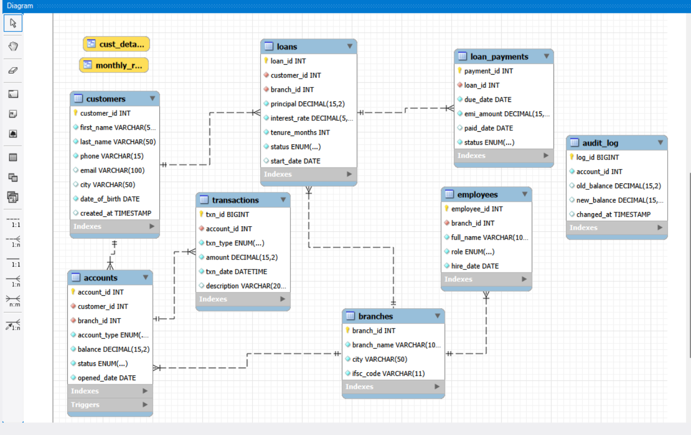

# Bank Management System (SQL Project)

A relational database for a bank, built in MySQL as a portfolio project. It covers database design,
day-to-day querying, and backend logic (procedures, functions, triggers,
transactions, and indexing).

## Tech Stack
- MySQL 8.0
- MySQL Workbench (for ER diagram and testing)

## ER Diagram


## Database Design
8 tables, normalized to 3NF: `branches`, `employees`, `customers`,
`accounts`, `transactions`, `loans`, `loan_payments`, `audit_log`.

Key design choices:
- Every table has a single-column primary key (surrogate key), with foreign
  keys enforcing relationships between tables.
- `CHECK` constraints stop bad data at the database level (e.g. a balance
  can never go below 0, a transaction amount can never be 0 or negative).
- `audit_log` is never written to directly by the application — it is
  filled only by the `log_balance_change` trigger, so every balance change
  is automatically recorded, even ones made outside the app.

## Files in This Repo
| File | What it does |
|---|---|
| `01_schema.sql` | Creates the database and all 8 tables, with constraints |
| `02_data.sql` | Inserts sample data (branches, employees, customers, accounts, transactions, loans, loan payments) |
| `03_queries.sql` | 20 practice queries: joins, GROUP BY, subqueries, CTEs, window functions |
| `04_stored_procedures_and_triggers.sql`| Stored procedure (`transfer_money`), function (`get_loan_interest`), trigger     (`log_balance_change`) |
|`05_indexes.sql` | Shows a query's EXPLAIN plan before and after adding an index |
| `06_transactions.sql` | Demonstrates COMMIT, ROLLBACK, and SAVEPOINT |

## SQL Concepts Covered
- [x] DDL: CREATE, constraints (PK, FK, UNIQUE, NOT NULL, CHECK, DEFAULT)
- [x] DML: INSERT, UPDATE
- [x] Joins: INNER, LEFT
- [x] GROUP BY, HAVING
- [x] Subqueries
- [x] CTEs (WITH clause)
- [x] Window functions: RANK/DENSE_RANK, SUM() OVER, ROW_NUMBER()
- [x] Views
- [x] Stored procedures
- [x] User-defined functions
- [x] Triggers
- [x] Transactions: COMMIT, ROLLBACK, SAVEPOINT
- [x] Indexing and query plans (EXPLAIN)

## How to Run
1. Open MySQL Workbench (or any MySQL client).
2. Run the files in order: `01_schema.sql` → `02_data.sql` → `03_queries.sql`
   → `04_views.sql` → `05_programs.sql` → `06_transactions.sql` →
   `07_indexes.sql`.
3. To test the money transfer procedure:
   ```sql
   CALL transfer_money(1, 2, 5000.00);
   SELECT * FROM audit_log ORDER BY log_id DESC;
   ```

## What I'd Improve With More Time
- Add user roles and permissions (GRANT/REVOKE) for teller, manager, and
  auditor access levels.
- Add a backup/restore script.
- Scale up the sample data to better demonstrate the index performance
  difference.
